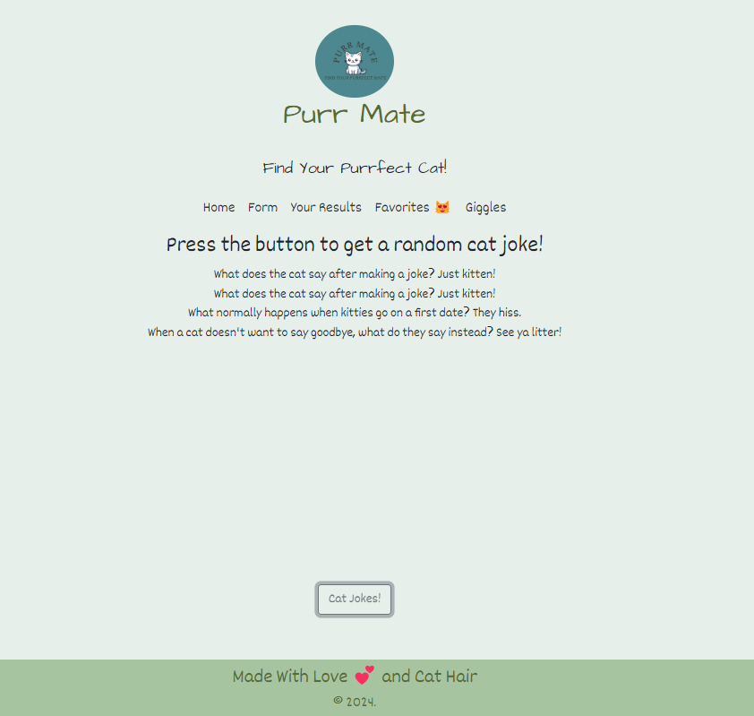

## Group Project 1:  
The README file will be well-organized and have:
Project description
Team members 
Screen shot 
Link to deployed version on Github Pages 

## Project Description:
Purr-Mate is a website where user can go to find a cat "mate" based on results from criteria given.

## Team Members:

## Group Colaboration:

## Lessons Learned

## Screenshot

## Links

*  Deployed code on GitHub Pages:

*  Working version of the code - N/A.

## Acknowledgment

## License

## Project Requirements:
- HTML:  Semantically correct and at least 2 pages
- Uses Bootstrap and custom CSS
- Responsive at mobile and desktop breakpoint
- Used jQuery and JavaScript
- Form where user provides information
- LocalStorage is used
- API data used
- Used one new technology, library....
- Code must be lean, well-organized with good file structure
- No bugs, no errors in dev console
- Frequent code commits by all team members
- A README file
- Final code deployed to Github Pages

